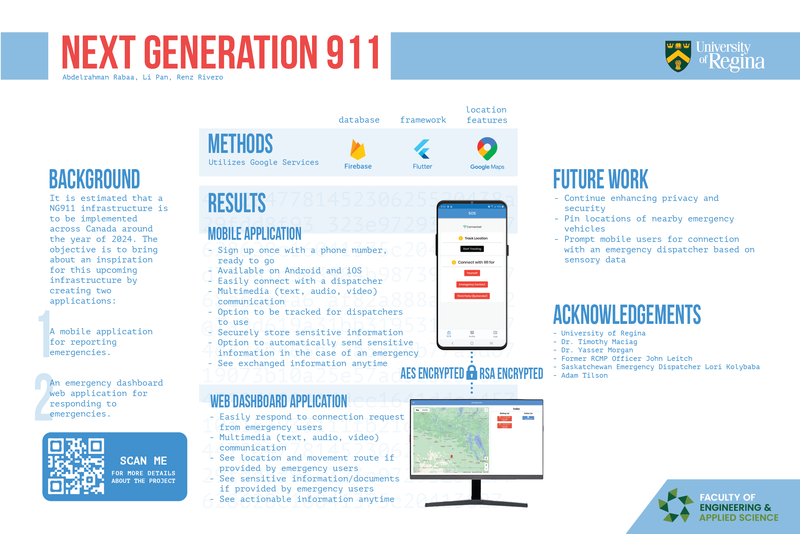

  

  <h1 align="center">
  Next Generation 911
</h1>

  

    Next generation 911 (NG911) is a Software Systems Engineering Capstone (2021/2022) project by Team Bugs (:octocat:[Abdelrahman Rabaa](https://github.com/Rabaa-basha) :octocat:[Li Pan](https://github.com/panli200) :octocat:[Renz Rivero](https://github.com/renzrivero))
  

---

## Design Documentation
### Prototypes
[Prototypes](https://github.com/panli200/NG911/tree/main/Documentation/Design-Prototypes)

Lo-fidelity Prototypes — Handrawn
- [Mobile Application Lo-fidelity Prototypes](https://github.com/panli200/NG911/tree/main/Documentation/Design-Prototypes/User-Client-Side/Lofi-Prototypes)
- [Dispatcher Dashboard Application Lo-fidelity Prototypes](https://github.com/panli200/NG911/tree/main/Documentation/Design-Prototypes/PSAP-Admin-Side/Lofi-Prototypes)

Hi-fidelity Prototypes - Made in Adobe XD
- [Mobile Application Hi-fidelity Prototypes](https://github.com/panli200/NG911/tree/main/Documentation/Design-Prototypes/User-Client-Side/Hifi-Prototypes) — [Demonstration and Background Video](https://drive.google.com/file/d/1QpDGlHGbElFlKYlJ61Bs_GObXn-j4FUU/view?usp=sharing)
- [Dispatcher Dashboard Application Hi-fidelity Prototypes](https://github.com/panli200/NG911/tree/main/Documentation/Design-Prototypes/PSAP-Admin-Side/HiFi-Prototypes) — [Demonstration and Background Video](https://drive.google.com/file/d/1XkkQXJtban5dI-80QY2J30C3lRvdlfQs/view?usp=sharing)

---

### Vlogs
1. Team and Project Introduction — [Vlog](https://youtu.be/ziVtzf-9uPU) (September 17, 2021)
2. Project Update — [Vlog](https://youtu.be/kcOifqv1obA) (October 15, 2021)
3. Needed dispatcher dashboard complementary application with our original idea — [Vlog](https://youtu.be/2lo1vUUzE8Y) (December 3, 2021)
4. Web dashboard application results for dispatchers — [Vlog](https://youtu.be/V186NkOB2oY) (February 1, 2022)
5. NG911 System — [Vlog](https://youtu.be/th1kwh1v-o0) (March 8, 2022)

---

### Scrums
1. September 24, 2021 — [Script](https://github.com/panli200/NG911/blob/main/Presentations/Scrums/Scrum-Scripts/Scrum%231-Script.pdf) | [Slide](https://github.com/panli200/NG911/blob/main/Presentations/Scrums/Scrum-Slides/Capstone-Scrum%231-Slide.pdf)
2. October 8, 2021 — [Script](https://github.com/panli200/NG911/blob/main/Presentations/Scrums/Scrum-Scripts/Scrum%232-Script.pdf) | [Slide](https://github.com/panli200/NG911/blob/main/Presentations/Scrums/Scrum-Slides/Capstone-Scrum%232-Slide.pdf)
3. October 22, 2021 — [Script](https://github.com/panli200/NG911/blob/main/Presentations/Scrums/Scrum-Scripts/Scrum%233-Script.pdf) | [Slide](https://github.com/panli200/NG911/blob/main/Presentations/Scrums/Scrum-Slides/Capstone-Scrum%233-Slide.pdf)
4. November 19, 2021 — [Script](https://github.com/panli200/NG911/blob/main/Presentations/Scrums/Scrum-Scripts/Scrum%234-Script.pdf) | [Slide](https://github.com/panli200/NG911/blob/main/Presentations/Scrums/Scrum-Slides/Capstone-Scrum%234-Slide.pdf)
5. February 8, 2022 — [Script](https://github.com/panli200/NG911/blob/main/Presentations/Scrums/Scrum-Scripts/Scrum%235-Script.pdf) | [Slide](https://github.com/panli200/NG911/blob/main/Presentations/Scrums/Scrum-Slides/Capstone-Scrum%235-Slide.pdf)
6. February 15, 2022 — [Script](https://github.com/panli200/NG911/blob/main/Presentations/Scrums/Scrum-Scripts/Scrum%236-Script.pdf) | [Slide](https://github.com/panli200/NG911/blob/main/Presentations/Scrums/Scrum-Slides/Capstone-Scrum%236-Slide.pdf)
7. March 15, 2022 — [Script](https://github.com/panli200/NG911/blob/main/Presentations/Scrums/Scrum-Scripts/Scrum%237-Script.pdf) | [Slide](https://github.com/panli200/NG911/blob/main/Presentations/Scrums/Scrum-Slides/Capstone-Scrum%237-Slide.pdf)

---

### Bazaar Days
1. January 25, 2022 — [Script](https://github.com/panli200/NG911/blob/main/Presentations/Bazaar/Bazaar#1/Capstone-Bazaar%231-Script.pdf) | [Slide](https://github.com/panli200/NG911/blob/main/Presentations/Bazaar/Bazaar#1/Capstone-Bazaar%231-Slide.pdf)
2. March 1, 2022 — [Script](https://github.com/panli200/NG911/blob/main/Presentations/Bazaar/Bazaar#2/Capstone-Bazaar%231-Script.pdf) | [Slide](https://github.com/panli200/NG911/blob/main/Presentations/Bazaar/Bazaar#2/Capstone-Bazaar%231-Slide.pdf)